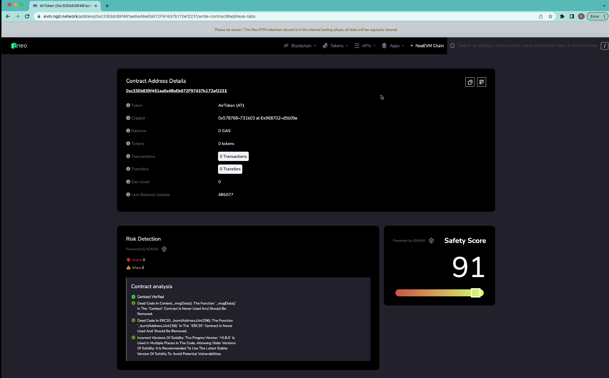
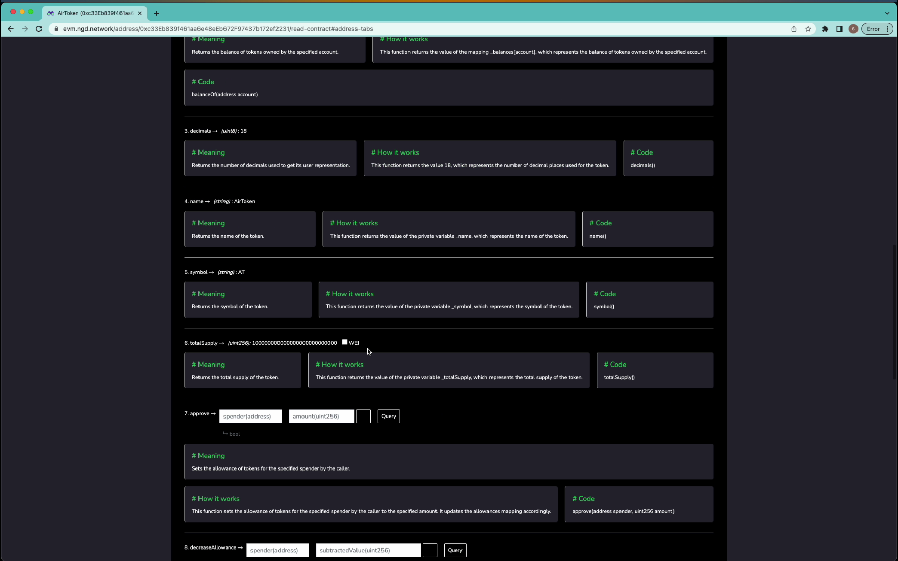

# Hackathon2023-GPT

The code of the explorer exntension for NEO APAC Hachathon 2023 contest.

## News

- [We won the First Prize of Neo APAC Hackathon Tokyo!](https://twitter.com/0xKekkai/status/1683401599711068160?s=20)🎉🎉🎉

## About NEO APAC Hachathon 2023

- [Contest Website](https://hackathon.neo.org/)

## Smart Contract Explorer Extension

We design a explorer extension to explain the smart contracts with reliability score assessment，which can aid the nonprofessional users to understand code and avoid risk. And it can also help developers to improve the security of smart contracts.

Detailed functions:

1. Display contract information and reliability score
2. Display the transaction and vulnerability risks of the contract
3. Display the explanation of the contract interface, including the working principle

    

  

## See also

- [Langchain: A framework for developing applications powered by LM](https://docs.langchain.com/docs/)
- [Slither: A Static Analyzer for Solidity](https://github.com/crytic/slither)
- [DREAD: A risk assessment model](https://en.wikipedia.org/wiki/DREAD_(risk_assessment_model))
- [OpenAI platform](https://platform.openai.com/docs/introduction)
