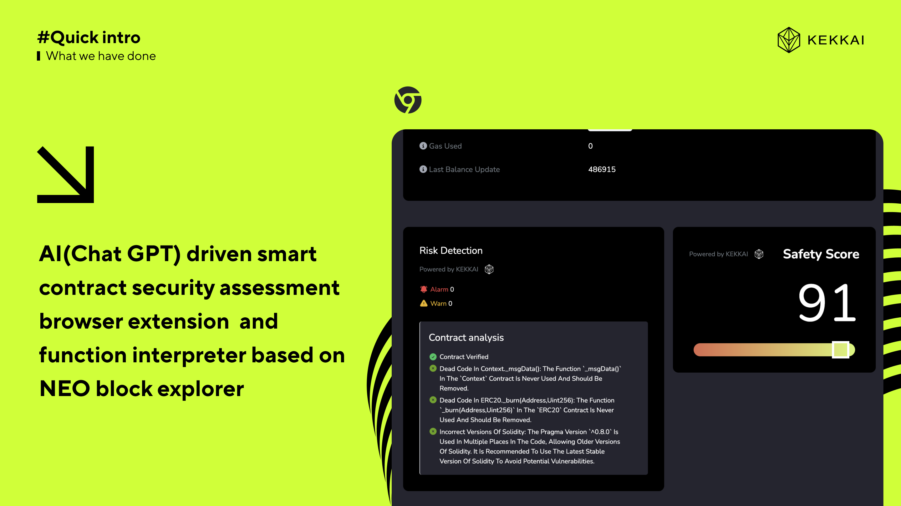
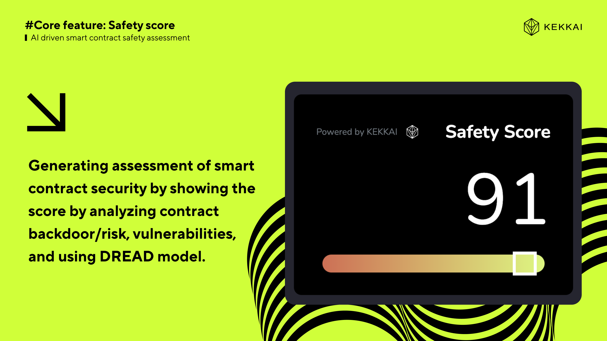
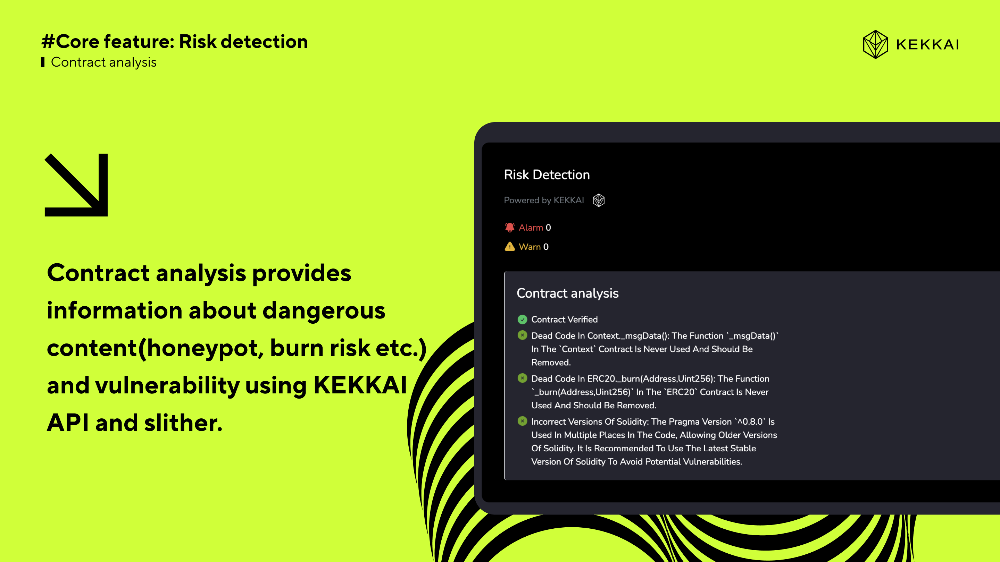
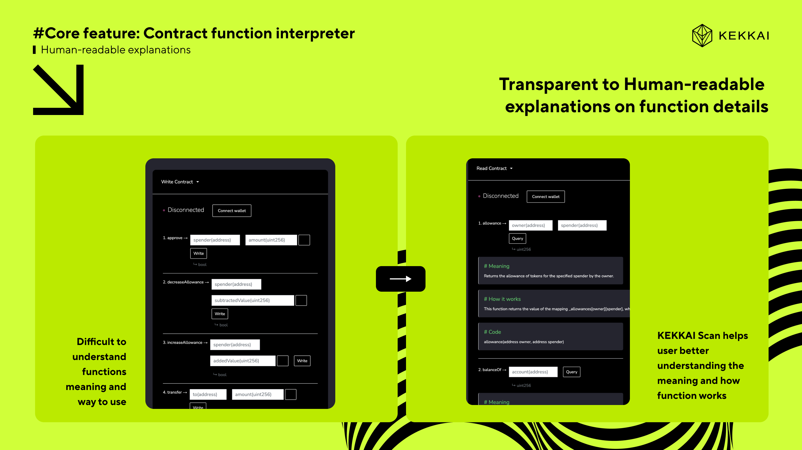
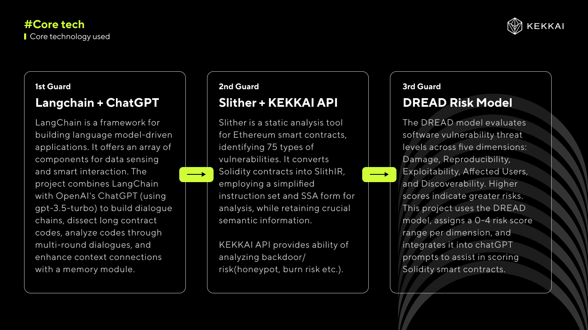

## Explorer Extension

Quick intro to KEKKAI Scan AI(Chat GPT) driven smart contract security assessment browser extension and function interpreter based on NEO block explorer

Core feature: Safety score Generating assessment of smart contract security by showing the score by analyzing contract backdoor/risk, vulnerabilities, and using DREAD model.

Core feature: Risk detection Contract analysis provides information about dangerous content(honeypot, burn risk etc.) and vulnerability using KEKKAI API and slither.

Core feature: Contract function interpreter

Core tech

